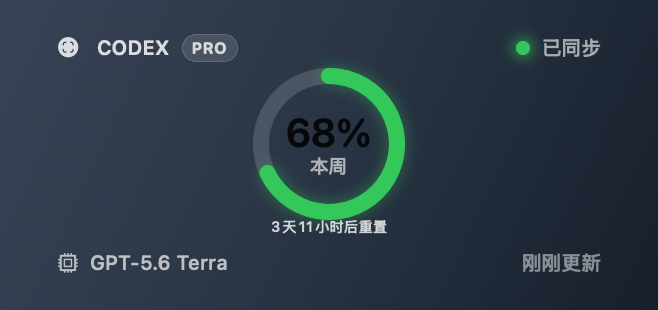
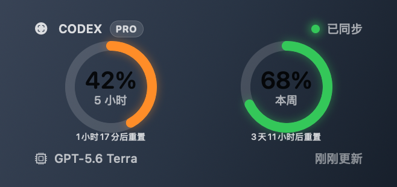
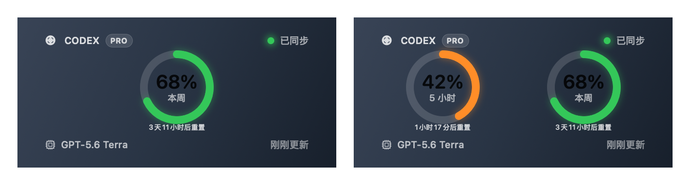

# Codex Lens

Codex Lens is a local-first macOS utility with two native surfaces: a **desktop widget** powered by WidgetKit and a **menu bar status capsule** powered by AppKit. It reads the current Codex model and quota state from an existing Codex Desktop login and keeps both surfaces updated. It is an independent, unofficial project and is not affiliated with or endorsed by OpenAI.

**中文简介：Codex Lens 同时提供桌面组件和状态栏胶囊。** 桌面组件支持小、中两种尺寸，展示服务返回的五小时与每周额度；状态栏胶囊常驻 macOS 菜单栏，显示五小时剩余额度、额度环和重置倒计时，点击即可展开当前模型、重置时间与同步状态，并进行手动刷新、开机启动设置或退出。

## Features

- Shows the active model, weekly limit, optional rolling five-hour limit, and reset times returned by the quota service.
- Provides Small and Medium WidgetKit families. A weekly-only response uses a single-window layout; a five-hour window appears automatically when present and disappears automatically when absent.
- Provides a native menu bar status capsule with a quota ring, five-hour remaining percentage, and reset countdown. Its width adapts to the full countdown text.
- Opens a native details popover when the capsule is clicked, with current model, reset time, sync state, **Refresh now**, **Start at login**, and **Quit**. Clicking the capsule only toggles the popover; refreshing is an explicit action.
- Keeps a last-known-good display-only snapshot so a damaged response or transient refresh failure does not fabricate quota data.
- Uses an Apple Team-ID-prefixed App Group shared only by the host app and its embedded Widget extension.
- Performs no telemetry, analytics, crash reporting, account changes, or reset-credit redemption.

## Desktop widget and status capsule

| Surface | Location | Display and interaction |
| --- | --- | --- |
| Desktop widget (桌面组件) | macOS desktop / Widget Gallery | Small and Medium layouts show available five-hour and weekly quota windows, model, reset times, and sync state. A weekly-only response remains a weekly-only widget. |
| Menu bar status capsule (状态栏胶囊) | macOS menu bar | A compact quota ring, five-hour remaining percentage, and reset countdown; click to open or close the native details popover. Right-click opens the tray menu. |

The status capsule uses the five-hour window only. If that window is absent or invalid, it retains a previous valid five-hour value with a stale indicator, or displays unavailable when no previous value exists. It does not substitute weekly quota for five-hour quota. The desktop widget continues to show whichever supported windows the service actually returns.

## Widget previews and screenshots

The images below are WidgetKit Preview assets for documented layouts, not browser, HTML, React, or AI-generated mockups. They use fixture data rather than an account snapshot.

| Weekly only | Five-hour and weekly |
| --- | --- |
|  |  |



The repository deliberately does not publish full-desktop captures or account-specific screenshots. A real desktop screenshot may be used for private validation only after all visible personal information has been reviewed and redacted.

## Requirements

- macOS 14 or later for the integrated WidgetKit extension.
- Node.js 20 or later, Rust stable, Xcode, and Tauri 2 prerequisites for a local build.
- An existing Codex Desktop login on the same Mac to read live quota data.
- An Apple Development Team selected in Xcode to install a signed local widget.

## Local development and build

```bash
npm install
npm run test
npm run build
cargo test --manifest-path src-tauri/Cargo.toml
cargo check --manifest-path src-tauri/Cargo.toml
scripts/check-status-popover.sh
npm run tauri dev
```

Browser development uses mock data. Live quota reads, the status capsule, and WidgetKit integration require the Tauri application on a Mac with an existing Codex Desktop login. The popover check uses fixture data to verify clicks across the capsule, including after its width changes; it requires an active macOS graphical session.

To build the Widget extension without signing:

```bash
xcodebuild -project native-widget/CodexLensWidgets.xcodeproj \
  -scheme CodexLensWidgetExtension \
  -configuration Debug \
  -derivedDataPath /tmp/codex-lens-widget-build \
  CODE_SIGNING_ALLOWED=NO build
```

To create an integrated, locally signed application, choose a Team in Xcode and run:

```bash
CODE_SIGN_IDENTITY="Apple Development: …" DEVELOPMENT_TEAM="…" \
  scripts/package-codex-lens-macos.sh
```

The package script embeds `CodexLensWidgetExtension.appex` in `Codex Lens.app/Contents/PlugIns`, checks both signatures strictly, and checks the App Group and Team match. It does not publish, notarize, or distribute the result.

## Apple Team and App Group configuration

`native-widget/CodexLensAppGroup.xcconfig` keeps only the suffix:

```text
CODEXLENS_APP_GROUP_SUFFIX = dev.codexlens.shared
CODEXLENS_APP_GROUP_ID = $(DEVELOPMENT_TEAM).$(CODEXLENS_APP_GROUP_SUFFIX)
```

The selected Xcode Team expands this to `<YOUR_TEAM_ID>.dev.codexlens.shared`. Use the same Team for the main application and Widget extension. Do not commit a Team ID, certificate, provisioning profile, or account configuration.

The shared files are `widget-snapshot.json` and `widget-snapshot.last-known-good.json`. They contain only schema/version information, active model, normalized limit windows, timestamps, source, and stale state—never a token, cookie, account ID, or raw quota response.

## Install, use the status capsule, and add the widget

1. Build the signed integrated app with the same Apple Team for the app and extension.
2. Install the resulting `Codex Lens.app` locally and launch it.
3. Find the status capsule in the macOS menu bar. Click it to open the details popover and choose **Refresh now** to request a live snapshot. **Start at login** and **Quit** are available in the same popover or the right-click tray menu.
4. On the desktop, choose **Edit Widgets**, search for **Codex Lens**, then add the Small or Medium desktop widget. The status capsule also works before a desktop widget has been added.

## Refresh behavior and development troubleshooting

The app refreshes at startup, every minute in the background, after wake, on manual refresh, and when reopened. Each completed refresh updates the status capsule and its details. After publishing a valid shared snapshot it calls `WidgetCenter.reloadTimelines(ofKind: "CodexLensWidget")`. WidgetKit controls the actual desktop-widget refresh schedule.

During development, macOS can keep an old Widget extension process alive after a new application has been installed. Use the explicit development-only command below only when that happens:

```bash
scripts/refresh-codex-lens-widget-development.sh /path/to/Codex\ Lens.app
```

It verifies the source app and embedded extension signatures, installs only `Codex Lens.app` to `/Applications`, terminates only a process whose executable path is the Codex Lens Widget extension, relaunches the app, and verifies that any replacement extension process comes from `/Applications/Codex Lens.app`. It never clears WidgetKit databases, removes desktop widgets, resets LaunchServices, changes App Group data, or terminates other widgets. The normal user launch path never invokes this command.

## Privacy

Codex Lens reads the local Codex Desktop login only to make the quota requests needed to display live status. It does not persist tokens, account IDs, prompts, chat history, raw quota responses, or local auth paths. It makes no calls to analytics, tracking, or crash-reporting services. See [PRIVACY.md](PRIVACY.md) and [SECURITY.md](SECURITY.md).

## Known limitations

- Codex quota responses are not a public stable API; an unsupported response is shown as unavailable or stale rather than guessed.
- A signed local install requires a valid Apple Development Team and matching entitlements.
- The Widget can display only windows returned by the current quota response. When only the weekly window exists, it intentionally shows only that window.
- The status capsule displays five-hour quota only; missing five-hour data appears as stale or unavailable even when a weekly window is available.
- The native desktop widget and status capsule are macOS features. Windows CI builds do not include WidgetKit or the AppKit capsule.

## Frequently Asked Questions

### Why is Codex Lens missing from Widget Gallery?

Confirm that `CodexLensWidgetExtension.appex` is embedded inside the installed `Codex Lens.app/Contents/PlugIns`, the app and extension are signed with the same Team, and both have the same expanded App Group entitlement. Then launch the installed app once and search for **Codex Lens** in Widget Gallery.

### Why does the widget say it is waiting for synchronized data?

Launch Codex Lens and select **Refresh now**. The widget waits until the host app has published its first valid display-only snapshot to the shared App Group. It will not invent a value when login, signing, App Group access, or quota reading is unavailable.

### Why must I choose an Apple Development Team?

macOS requires a signing identity and entitlement authorization for a locally installed Widget extension. The Team supplies that authorization during development.

### How is the App Group generated automatically?

The source stores a suffix only. Xcode expands `$(DEVELOPMENT_TEAM).dev.codexlens.shared`, and the packaging script supplies the same expanded value to the main app before signing.

### Why must the main app and widget use the same Team?

They need matching signing authority and the same App Group entitlement to exchange the display-only snapshot. Mismatched Teams cannot safely share that container.

### Why might old UI remain after reinstalling?

WidgetKit may keep an old extension process alive. This does not mean WidgetKit storage is corrupt. Use the targeted development refresh command in the troubleshooting section; do not clear WidgetKit databases or delete unrelated widgets.

### How do I refresh only the Codex Lens Widget extension during development?

Run `scripts/refresh-codex-lens-widget-development.sh /path/to/Codex\ Lens.app`. It identifies the exact extension executable by its Codex Lens installation path before signalling it, then verifies the replacement path.

### Why does the widget currently show only the weekly limit?

The current quota response contains only a weekly window. The widget intentionally renders only data actually supplied by the service.

### Will the five-hour limit reappear automatically?

Yes. When a valid rolling five-hour window returns in a later snapshot, the Small and Medium widgets automatically switch to the dual-window layout.

### Does Codex Lens upload my account, model, or quota data?

No. It uses the existing local login only to make the required quota requests from the desktop process. It does not send data to a separate Codex Lens service and does not include tracking.

### Is Codex Lens an official OpenAI project?

No. Codex Lens is an independent, unofficial project and is not affiliated with or endorsed by OpenAI.

### Why can local builds fail at signing?

The selected Team may be missing, the signing identity may not match the provisioning authorization, or the host and extension entitlements may not match. Choose one Team for both targets and do not hard-code a Team ID.

### How do I refresh data manually?

Launch Codex Lens, click the status capsule, and use **Refresh now** in its details popover. The same action is available in the right-click tray menu. A successful snapshot publish requests a timeline reload for the Codex Lens widget kind.

### Can I use the status capsule without adding a desktop widget?

Yes. Launch the host app to use the menu bar capsule and details popover. Adding a desktop widget is optional; it requires the signed integrated app with its embedded WidgetKit extension.

### Why can the desktop widget show weekly quota while the capsule says unavailable?

The desktop widget supports weekly-only data, while the status capsule intentionally displays five-hour quota only. If the service does not return a valid five-hour window, the capsule shows unavailable or marks a retained five-hour value as stale.

### Do I need to clear WidgetKit data or remove every desktop widget?

No. Do not clear the WidgetKit database, remove other desktop widgets, reset LaunchServices, or delete App Group data as part of normal troubleshooting. The targeted development refresh command is the safe escalation for a stale Codex Lens extension process.

## Acknowledgements and upstream project

Codex Lens is based on and extends [Quota Float](https://github.com/change-42-yhmm/quota-float). The upstream project, repository address, MIT license, and copyright notice are retained. This repository is a copied-and-modified derivative, not a GitHub fork; the relationship and material changes are documented in [THIRD_PARTY_NOTICES.md](THIRD_PARTY_NOTICES.md).

## License

This project is released under the [MIT License](LICENSE), including the retained Quota Float copyright notice. See [THIRD_PARTY_NOTICES.md](THIRD_PARTY_NOTICES.md) for attribution.
